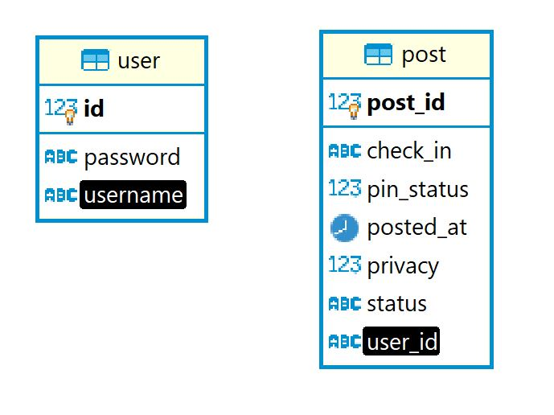
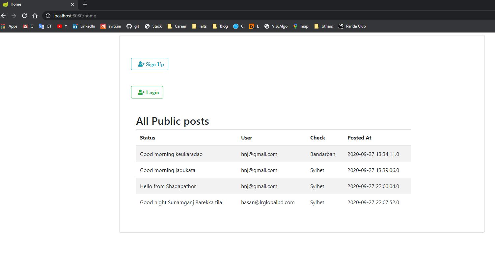
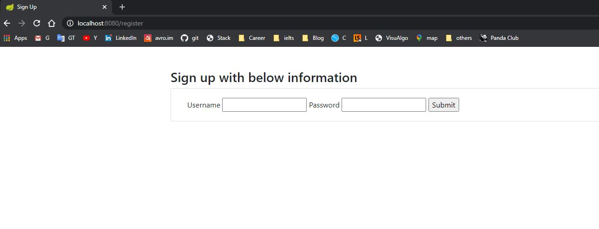
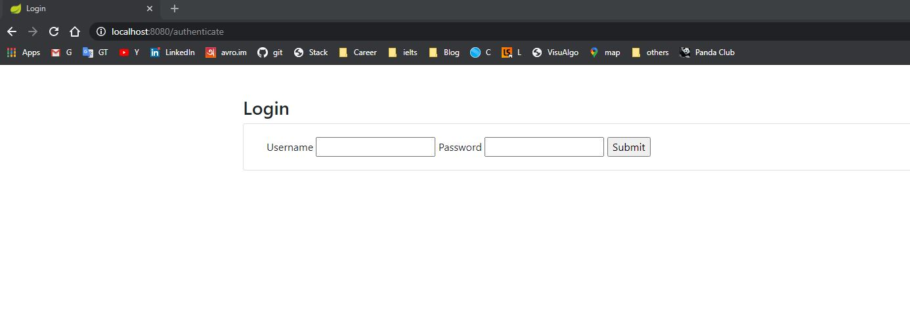
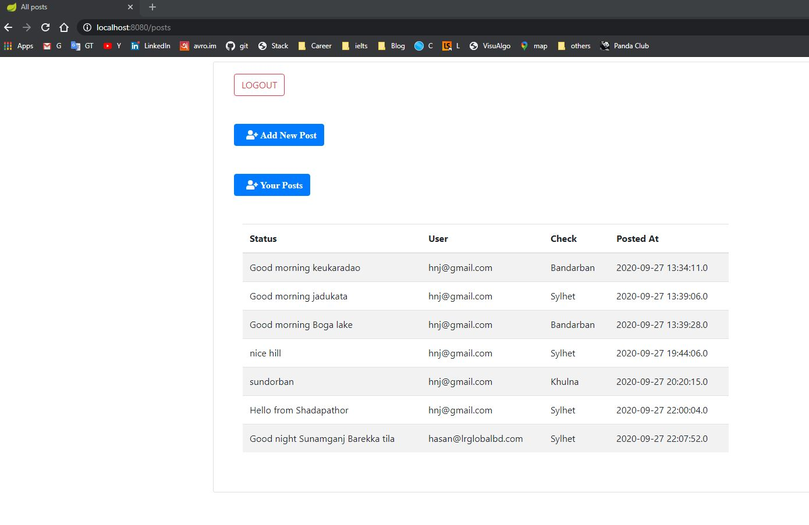
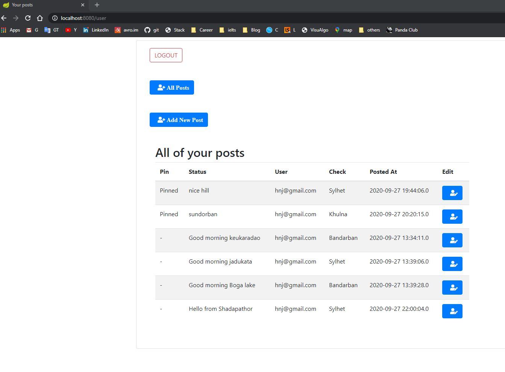
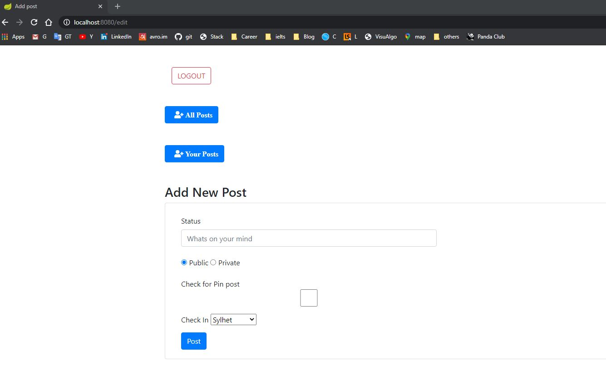
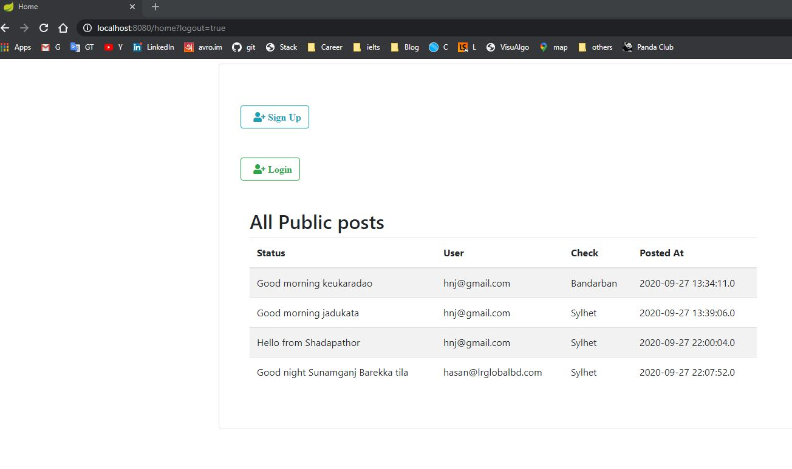

## Technologies used
- Java 8
- Spring Boot
- Spring Security
- JWT [JSON Web Token]
- Spring Data JPA [Hibernate]
- MYSQL
- Logback
- Thymeleaf
- Maven

## System configuration prerequisites to run the application
### 1. Clone the project
Open terminal and run
````
git clone https://github.com/hnjaman/social-media.git
````
In your current directory ``social-media`` directory will be created.

### 2. Install Java and Maven
Install java 8 or higher version and Apache Maven 

### 3. Integrate a MySQL database with the application
Just two table are used here  


Note: No need to create any table. It will create by itself when run the application. Just create ```post``` database
and put its credential in *application.properties* file 
```
spring.datasource.url=jdbc:mysql://locathost/post?createDatabaseIfNotExist=true&autoReconnect=true&useSSL=false
spring.datasource.username=username
spring.datasource.password=password
```

## Run the application
````
cd social-media/
mvn clean install
mvn spring-boot:run
````

go to your browser, visit ``http://localhost:8080/home`` and you will see with all public posts

### Home page


### Sign up


### Login


### All users post


### Logged user's posts


### Make a new post


### Edit a post


### Logout

